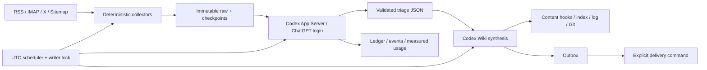

# Codex-native architecture

## 所有と実行

`src/ai_topics_codex` はジョブ実行、状態、認証・プロトコル、復旧、配信を所有。
`assets/scripts` は既存の収集・検証処理を引き継ぎ、`assets/skills` と `assets/prompts` は Codex 用に再設計。
モデルはファイル編集・shell・native web searchを担当します。汎用ハーネス切替層はありません。

## パス契約

| 用途 | 新しい場所 |
|---|---|
| profile / subprocess HOME | `WIKI_PROFILE_ROOT`（CLI `--profile` が優先） |
| Wiki | `~/wiki` → `~/ai-topics/wiki` |
| 運用状態・コード | `~/.wiki-agent` / `~/.wiki-agent/scripts` |
| チェックポイント | `~/.wiki-agent/checkpoints/<pipeline>` |
| 成功した出力 | `~/.wiki-agent/outputs/<job-name>` |
| 実行履歴・イベント | `~/.wiki-agent/runs.db` / `runs/<run-id>` |
| Codexスキル | `~/.agents/skills/<name>/SKILL.md` |
| 認証 | `CODEX_HOME`、既定は profile の `~/.codex` |
| RSS DB | `~/.blogwatcher/blogwatcher.db` |

スクリプトが profile を解決する順は `WIKI_PROFILE_ROOT` → `WIKI_SUBPROCESS_HOME` → `Path.home()`。CLI は未指定時に checkout の `profiles/lucy` を使用。操作者の `HOME` / `CODEX_HOME` や旧環境変数を暗黙に引き継ぎません。既存認証の共有は `codex.auth_home` を明示します。

旧 content AGENTS.md は追跡ファイルとして保存し、ローカル `AGENTS.override.md` で運用指示を置き換えます。これは `.git/info/exclude` に登録され、content commit に入りません。新スキルは user scope に配置し、ジョブが選ぶSKILL本文も明示的にpromptへ読み込みます。

## モデル接続

`codex app-server` の stdio JSONL で initialize → account/read → account/rateLimits/read → thread/start → turn/start → item/turn completionを処理します。Codex 0.157.1 の生成スキーマと照合しました。構造化ターンは `outputSchema`、対話承認要求は拒否、タイムアウトは interrupt とプロセスグループ終了で扱います。commentaryを最終回答に採用せず、thread/turnを照合します。[App Server仕様](https://learn.chatgpt.com/docs/app-server)

認証typeが `chatgpt` でない場合は実行を停止。モデルはOpenAI providerへ固定し、API key / WIF / 別アクセスtokenの環境変数を除外します。通常枠が使えない・枠上限・spend controlに達した場合は停止し、API課金やreset creditへ切り替えません。モデル名は任意設定、未指定ならCodexの既定。上限到達後のジョブは失敗記録となり、明示再実行が必要です。

配送用token、IMAP password、Slack tokenをモデルprocessの環境から除外します。ただしprofile内のファイルはツールから読みうるため、sandboxが秘密ファイルの完全な秘匿境界だとは主張しません。実行ログはprivate扱いで、既知の秘密値を記録前にredactします。

## Handoffと失敗

- 収集はモデル呼出し前に一度。exit失敗またはJSONの `ok:false` / `error` を実行失敗へ昇格。
- triage/groupingはstrict schemaで出力させ、別途ローカルで型・必須項目・重複ID・入力checkpoint IDを検証。
- takeはこのprofile内に実在する原文パスが必要。全入力candidate IDに決定が必要。groupは既知のdecision IDを参照。
- 成功時のみ `outputs/<name>/latest.json` をatomic publish。次段はJSONを読み、Markdownから再抽出しません。
- 上流が失敗・古い・より新しい祖先実行より前なら下流を停止。上流skipは下流にも伝播し、古いJSONは使いません。
- run ID、thread/turn ID、final、events、実測token usageを保存。APIドル料金を推定しません。

失敗モデルは `retry <run-id>` で保存入力を再利用できます。収集完了markerと依存run IDを記録し、collectorの二重実行を避けます。最新の失敗runのみ対象で、上流が変わった場合は拒否します。モデルの途中のファイル編集は残りうるため、再試行前に差分を確認します。

## Schedulerとwriter

UTCの5-field cron、day-of-monthとday-of-weekはVixie OR。30ジョブ中27有効・3停止を維持。永続minute cursorとjob/slotのUNIQUE claimで重複起動を防止し、profile全体のflockでwriterを直列化。catch-upは既定1440分までです。

crashでrunning行が残ればschedulerを止めます。`recover`で副作用確認後に失敗を確定し、必要なjobのみ手動再実行。外部取得やモデル副作用についてexactly-onceは保証しません。別hostやwrapperを使わない手動編集までlockできないため、1profileに1writerが運用契約です。

## 配信と公開

outboxは内容処理と独立。再送はWikiジョブを再実行せず `outbox --deliver`。provider受理後のcrashによる重複はあり得るのでrun IDを付けます。初期設定は送信しないoutboxのみ。

`publication`は `local` / `commit` / `push`。日常のモデル作業指示に反映されます。Git認証、hook実行とremoteは配備先の責任。push失敗時のforceや自動resetは認めません。

## Sandbox

HostはCodex `workspace-write`、writable rootsは専用profile。Docker版はroot filesystem read-only、非root、cap_drop ALL、no-new-privileges、tmpfsとprofile mountに限定し、Codex `externalSandbox` を使います。明示環境設定とcontainer markerがないhostでexternalを要求すると拒否します。このmarker検査だけがセキュリティ境界ではなく、Composeの隔離設定が実体です。Docker socket、host filesystem全体、production以外のprofileをmountしません。
