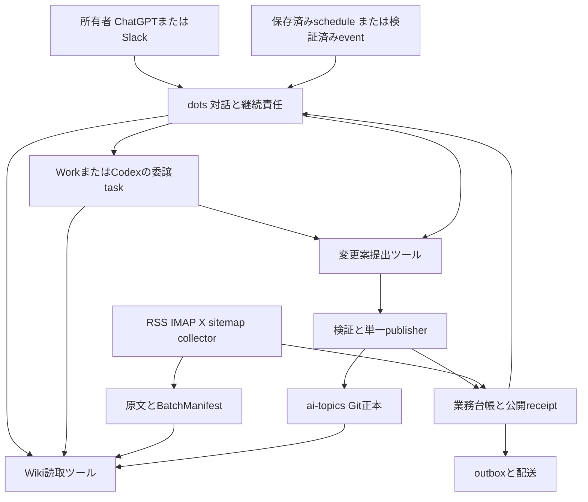

# dotsによるWikiエージェント再実装の調査と設計案

調査日: 2026-10-01 JST。状態: 提案・未実装。

**dotsを使って、Wikiの自動管理と所有者向け問い合わせ体験を再構成できる見込みはある。推奨は、dotsに継続的な責任・対話・調査・委譲を任せ、原文保管・処理台帳・検証・公開を限定ツールとして残す構成である。**

dots単体に既存30ジョブのpromptを渡すだけでは、現在の更新競合対策や失敗復旧まで再現したことにならない。また、DiscordやTelegramの直接問い合わせ窓口、所有者以外が指示する共有bot、ヘッドレスサーバーへの直接接続は、確認したdots資料では同等性を確立できない。

短期は既存Codex版を処理基盤として使う併用案を検証し、次にblog一本でdotsによる選別・統合まで試す。dotsの実行面でツールと成果物を受け渡せることを確認できれば、独自モデル通信や一部の起動管理を撤去できる。Pi版は同じ業務成果物を扱う別構成として維持する。

本書の「確認」は公式資料またはローカルソースによる確認、「提案」は設計判断である。対象アカウント上でdotの作成、実行、定期登録、接続試験は行っていない。稼働中Lucy/Nana、収集元、通知先を変更していない。

## 現行システムで再現する責務

調査時のcheckoutはCodex版 `d0750e7`、Pi版 `f4b13c8`、共通移植版 `7a368bb`。Codex版とPi版のmanifestはともに**30ジョブ、有効27・停止3**である。これは今回のファイル確認結果であり、本番の最新稼働状態の再監査ではない。

| 対象 | 確認した役割 | dots設計での扱い |
|---|---|---|
| ai-topics | 原文、curated Wiki、SCHEMA、index、log、feed定義 | コンテンツの正本として維持 |
| Hermes運用 | Discordから質問・調査・統合・lint・ページ作成を指示 | 所有者向けdots窓口と、必要なら別のbot窓口へ分ける |
| ai-topics-codex | Codex App Server、専用profile、台帳、排他、checkpoint、検証、Git公開、outbox | 短期の実行基盤。dotsアダプターを追加しない |
| ai-topics-pi | Pi SDKのsessionとtools、OSによるtick、SQLite、収集・公開・配信 | 別のモデル／ハーネス構成として維持 |
| Wiki問い合わせ | SCHEMAと索引から探索し、ページとrawの出典を読む | snapshot指定の読取ツールを共通化 |

確認箇所: [Codex設計](architecture.md)、[Pi設計](../../ai-topics-pi/docs/architecture.md)、[旧Lucyの調査](../../ai-topics-agent/docs/audit.md)、[Hermes問い合わせ例](../../ai-topics/docs/SETUP.md)、[Wiki MCP](../../ai-topics/docs/wiki-mcp.md)。

現行Codexコードでも、job/slotの一意claim、profile lock、依存段階の成功と鮮度の確認、既存rawのhash確認、runnerによるhook付き公開が実装されている。一方、失敗したモデルが途中まで編集した差分は残り得る。隔離workspaceとChangeSetによる公開は、[モジュール化設計案](modular-wiki-design-draft.md)で提案されている将来の改善であり、完成済み機能とは扱わない。

注意点として、Pi版の `wiki-search` は現状、Brave等への**Web検索**である。Wiki内の検索をそれだけで代替したとは扱わない。既存のfilesystem MCPもファイル名検索が中心であり、全文・metadata検索は追加の実装または検索基盤が必要になる。

## 公式資料から確認したdotsの境界

DevDay公式案内は2026-09-29付。dotsは継続的な仕事を担う常時稼働エージェントとして発表されている。[DevDay 2026](https://learn.chatgpt.com/docs/whats-new/devday-2026)

| 論点 | 公式に確認した事項 | 本システムへの設計判断 |
|---|---|---|
| 継続作業 | 背景エージェントや別threadへ委譲し、会話の間も作業を継続できる | 問い合わせ中も収集・調査を進める責任者として適合 |
| 定期実行 | 固定時刻の仕事には保存済みscheduleが必要。対応サービスのevent監視もある | 「毎日続けて」だけでは時刻・対象・通知条件が不十分 |
| メモリ | ChatGPT memoryと独自の保存メモを使う。全会話の完全な記録ではない | 処理済み記事や公開成功の正本にはしない |
| 子taskの文脈 | 子taskへ必要な指示と文脈を渡す。全会話が自動継承されるわけではない | batch、資料、版、権限、出力契約を明示する |

上記の根拠: [Tasks and memory](https://learn.chatgpt.com/docs/dots/tasks-and-memory)。台帳や成果物の持ち方は本書の提案である。

| 論点 | 公式に確認した事項 | 本システムへの設計判断 |
|---|---|---|
| 実行場所 | dot自身のcloud computerとbrowserがある。ローカル接続は1台で、端末オンライン・ChatGPTアプリ稼働が必要 | cloud常時稼働と、ローカルのWiki実行可能性を分けて考える |
| 委譲先 | local Work/Codex taskを作成でき、設定済みCodex cloud environmentも使える | 既存repositoryでの作業候補。ただし常駐collectorの配備機能とは別 |
| 接続 | メッセージ窓口、plugin、ローカルPCの接続は独立。local skillは接続PCが必要 | ~/.agents/skillsを置くだけでcloud dotに配布されたとは扱わない |

根拠: [Computers and apps](https://learn.chatgpt.com/docs/dots/computers-and-apps)。クラウドPCが状態を保持し得ることから、永続DBのSLAや常駐daemonの保証までは導かない。

| 論点 | 公式に確認した事項 | 本システムへの設計判断 |
|---|---|---|
| 窓口 | ChatGPT、音声、Slack、Teamsが記載されている | 個人用の対話窓口を移せる候補。Discord／Telegramの直接窓口は未確認 |
| 共有利用 | 管理者資料ではSlackでdotに指示できるのは所有者だけ。Teamsは招待制alpha | チームの誰でも指示できるHermes botの直接代替にはしない |
| 自律的な書込 | 指定済み作業と、読取だけのproactive researchは別。actionは権限・自動審査に従う | 「自発的に調べる」を自動Wiki公開と読み替えない |

根拠: [Messaging](https://learn.chatgpt.com/docs/dots/channels)、[管理者向けdots仕様](https://learn.chatgpt.com/docs/enterprise/o-admin-guide)、[Controls](https://learn.chatgpt.com/docs/dots/controls)。明示的な継続指示でも全ての確認を除去できるとは約束しない。

公開資料の調査では、任意のdotを外部から起動し、最終JSONを取得する一般的なAPIは確認できなかった。これは「APIが絶対に存在しない」という断定ではない。Workspace Agentsには別の起動APIがあるが、対象は公開済みworkspace agentで、現時点では回答本文を取得できない。dot用APIとして流用する設計にはしない。[Workspace Agentsの起動仕様](https://developers.openai.com/workspace-agents/trigger-runs)

## 構成案の比較

| 案 | 構成 | 撤去できる候補 | 残る負担 | 評価 |
|---|---|---|---|---|
| A 既存基盤との併用 | dotsが質問・状況確認・作業依頼を担い、既存Codex/Pi runnerが処理 | 所有者向けgatewayの一部、状況確認の手作業 | runner、scheduler、ホスト、collector、公開・配信 | 最初の接続検証に推奨 |
| B dotsを主な実行主体にする | dotsと委譲taskが選別・調査・変更案を作る。Wikiツールが取得・検証・公開を担う | 独自App Server通信、一部のモデルsession管理・定期起動管理 | Wiki固有の状態・ツールサービス・収集元固有処理 | 全体再実装の目標案。実機検証が条件 |
| C dotsのPCだけで全運用 | cloud computerに全データとcollector等を置き、dotsがshellで運用 | 自前ホストの一部を減らせる可能性 | 復旧、バックアップ、secret、toolchain、常駐性の確認 | 現時点で本番採用しない |

Aは「dots版への全面移植」とは呼ばない。Bもコードゼロにはならないが、残るコードをWikiの取引とデータ保全へ絞れる。Cは同等性の根拠が不足しており、「cloud computerがある」だけでheadless VMの置換を確定しない。

提案として、dots固有のskill、plugin設定、接続試験、運用契約は将来の `ai-topics-dots` に置く。既存Codex repositoryの契約はCodex App Server専用なので、そこへ汎用ハーネスregistryを復活させない。共通化する対象は業務成果物と検証ロジックであり、各ハーネスのagent loopではない。

## 推奨構成の責任分担

次の図は案Bの提案である。既存実装に存在しないツール名も含む。

| 所有者 | 責任 |
|---|---|
| dots | 優先順位、質問への回答、調査方針、委譲、保留理由の説明、通知条件の適用 |
| 委譲task | 固定資料の選別、追加調査、隔離領域でのWiki変更案作成 |
| collector | 取得ID・cursor、全文保存、取得品質、RSS/IMAP/X固有の挙動 |
| Wikiツール | 入出力schema、batch同一性、hash、権限、排他、公開receipt、検索snapshot |
| publisher | hooks、リンクとfrontmatter、原文不変性、競合検出、commit/push |
| delivery | 許可済み宛先への配信、配送結果、本文生成と独立した再送 |

dotsのActivity上の「完了」と業務台帳の「公開確認済み」は別の状態にする。通知だけ失敗した場合はdeliveryを再試行し、記事の再収集やWiki再生成を行わない。

ローカルで検証するAは、接続PCの専用profileと既存runnerを使う。runnerへの依頼を自由なshell文字列にせず、許可jobと固定profileを指定する薄い境界にする。dotsがrunnerを呼ぶと内部でもCodex/Piが動くため、二段の推論と利用枠を計測する。

案Bではcanonical dataをdotsの一時workspaceから独立させる。初期は一つのホストでSQLiteとartifact保管、collector、publisherを維持してよい。複数ホストへ分散する段階では共有DBとlease/fencing等が必要になり、SQLiteやflockを共有mountで代用しない。

## 限定ツールと成果物の提案

以下は**新規実装候補**であり、dotsの既存APIではない。最初は読取だけを公開し、書込は検証環境で順次加える。

| ツール候補 | 入力と出力 | 守る境界 |
|---|---|---|
| wiki_status | 有効job、最新成功、backlog、公開commit、索引版、未処理保留 | 秘密値や別利用者の履歴を返さない |
| wiki_search | 英語query、type/tag/date、snapshot、上限 → page ID、抜粋、出典ref | Web検索と別tool。索引が古ければ明示 |
| wiki_read | page/raw IDと版 → 本文、hash、出典metadata | 任意OS pathを受け付けない |
| wiki_prepare_batch | pipelineと論理slot → batch ID、manifest、取得receipt | 許可された収集だけ。再呼出しで二重取得を避ける |
| wiki_get_context | batch、Wiki base commit → ContextBundle | 原文品質と取得欠落を含める |
| wiki_submit_decisions | batch/bundle、candidate全件のDecisionSet | 未知ID、欠落、重複、出典改変を拒否 |
| wiki_submit_changeset | base commit、patch、証拠ref → ChangeSet ID | raw上書き、管理領域、symlink、path逸脱を拒否 |
| wiki_validate_changeset | ChangeSet ID → 構造検証結果と意味上の保留 | agentの自己申告だけで合格にしない |
| wiki_publish_changeset | ChangeSet ID、認可済み操作 → PublicationReceipt | 公開範囲とpolicyをサーバー側で固定 |
| wiki_request_run | A用。許可job、slot、request ID → run ID | runnerへの依頼。dotの起動APIとは別 |

共通契約は [モジュール化設計案](modular-wiki-design-draft.md) のBatchManifest、ContextBundle、DecisionSet、ChangeSet、PublicationReceiptに合わせる。wire上はartifact IDを使い、profile内の絶対pathをハーネス間の共通契約にしない。

子taskへの依頼には、対象batch、資料の版、Wiki base commit、許可capability、期限・予算、提出形式を含める。dotsの会話から情報を推測して埋める運用にはしない。出力schemaに従うよう指示するだけで、Codexの `outputSchema` と同じ強制力があるとは仮定せず、tool受理時に検証する。

処理状態は `collected → decided → proposed → validated → committed → pushed` とし、`no_change`、`abstained`、`blocked`、`failed`を区別する。空batchは正常な空入力であり、昨日のcheckpointを代用しない。

並列に準備した変更案はpublisherだけが直列に適用する。base commitが変わったら関連資料を再確認し、初期はstale baseを拒否して再生成する単純な規則でよい。patchが適用できても、意味が変わっていないとは限らない。

公開意図と操作IDを台帳に先に保存する。push応答を失ったらremote commitを照合し、公開済み案を再commitしない。IMAP処理や外部通知まで含むexactly-onceは約束せず、外部receiptと業務状態を照合して復旧する。

## Pluginとeventによる接続

公式資料では、pluginはskillsとMCP toolsをまとめられ、hosted ChatGPTからremote MCPを使える。ローカルCodexの設定ファイルはそのままcloud ChatGPTへ引き継がれない。cloudで動くhookにも制限がある。[Plugins](https://learn.chatgpt.com/docs/plugins)、[MCP接続](https://learn.chatgpt.com/docs/extend/mcp)

提案する `ai-topics-wiki` pluginは、問い合わせ手順、選別・統合手順、health修復手順、上記限定ツールを持つ。Hermesのskill資産はpolicyと出力例として移すが、固定profile pathや内部Python import、shell前提は置き換える。skillが実行時に読み込まれたこととtool権限を、dot本体と子taskの両方で確認する。

新しいMCP Eventsは、MCP 2.0とWebhookを使って購読chatへ更新を届ける。サーバー側に購読状態の永続化、callback検証、署名、再送が必要で、受信の2xxは処理完了ではない。重複と順序逆転も想定する。[MCP Events](https://developers.openai.com/plugins/build/mcp-events)

本システムでは `wiki.batch.ready` と `wiki.run.attention_required` が有力なevent候補である。payloadはbatch/run ID、状態、件数、読取refを中心とし、原文全文や命令文を送らない。読取toolで詳細を取得する。

**dotsがこのcustom eventを購読できるかは未確認であり、案Bの接続試験項目にする。** 一般ChatGPTのevent対応から、dot本体と全委譲taskでの対応まで自動的には導かない。使えなければ保存済み定期taskから未処理batchを問い合わせる方式を使い、eventを必須にしない。両者が重複して起動しても、同じbatchのclaimで二重処理を抑える。

MCP Eventsの購読を作ることは、Discordの任意ユーザーが所有者のdotへ直接命令できることを意味しない。通知された投稿はデータとして扱い、既に認可された仕事の範囲で処理する。

## 30ジョブの移植対応

下表は案Bへの移植先の提案。ジョブ名は現行manifestに一致する。起動のまとめ方と処理開始時刻の変更は本番切替前に決める。まず選別・統合は同じbatchの成功に従って進め、固定20分間隔で古い出力を読み直す構成を避ける。

| 現行job | 提案するdotsの責任 | ツール側に残す処理 |
|---|---|---|
| blog-ingest / blog-triage / blog-wiki-ingest | blogの一つの収集・選別・統合workflow | feed取得、raw、batch、候補全件検証、公開 |
| newsletter-ingest / newsletter-triage / newsletter-wiki-ingest | newsletterの一つのworkflow | Message-ID dedup、IMAP副作用とreceipt、原文保存 |
| dreaming-collect / dreaming-group / dreaming-wiki-ingest | 既存記事を横断して新しい関係を統合 | 既存資料の固定、group参照、skip/reference archive |
| x-bookmarks-ingest | bookmark本文・リンク先取得とWiki統合 | X認証、post ID、本文種別、dedup |
| x-accounts-scan | 追跡account投稿の選別と統合 | cursor、post ID、取得上限、部分取得の記録 |
| active-crawl | Wikiの不足に沿った能動調査 | 取得receipt、原文追加、予算、公開 |
| sitemap-monitor | 必要時の状況説明 | 定義済みURL差分の機械処理。LLM不要 |
| skeleton-enrich-daily | 薄いentity pageの出典付き補強 | 対象snapshot、最低限の資料、変更案検証 |
| wiki-health-fix / wiki-watchdog-fix | 検出問題の調査と修復案 | 構造scan、公開前の再検証 |
| tag-audit-weekly | taxonomy逸脱の分類と修正案 | 機械検出、許可taxonomy、変更検証 |
| wiki-graph-analysis / hierarchy-candidate-detection | graph分析と再編候補 | graph計算、候補snapshot、再編の公開規則 |
| trending-topics | 期間内の証拠付きトレンド報告 | source期間とWiki版の固定 |
| weekly-ai-digest | 週次digest作成 | 変更抽出、確定outbox、Telegram等への配送 |
| ai-topics-slack-hot-posts | hot-postの日本語要約と出典確認 | reaction等の取得、dedup、Discord等への配送 |
| llm-pricing-monitor | 公式情報の比較と変更説明 | 取得日時、通貨・単位、差分、検証 |
| pipeline-watchdog | 停滞原因の説明と限定的な復旧依頼 | 有効job別の鮮度、実行台帳、重複claim検出 |
| check-skill-inventory / skill-drift-check | 資産差分のレビュー | manifest/hash検査。運用資産変更は開発工程 |
| jp-to-en-translation | 英語Wikiへの翻訳変更案 | 範囲・構造照合、出典保持、公開 |
| wiki-health / wiki-health-plan / raw-backlog-ingest | 停止状態を維持。必要時に明示的な手動処理 | enabled=falseを勝手に解除しない |

dreamingによるWiki再統合とdotsのprivate memoryは別の責務である。独自メモに関連情報が保存されても、curated page、出典、index、logが更新されたことにはならない。

既存scheduleはUTC。例えばblog収集 `0 10 * * *` はJSTの毎日19:00、newsletter収集 `10 10 * * *` は19:10、dreaming収集 `0 18 * * *` は翌JST日付の03:00。集約後のslotは原scheduleを参照して正規化し、日付跨ぎをテストする。

特にX accountの `30 22 */2 * *` はUTCの奇数日22:30であり、前回から48時間間隔ではない。月末で間隔が変わる。一般的な「2日おき」へ自然言語変換せず、暦条件を維持できなければこのcollectorのtimerを残す。

Slackの標準event taskではreaction、編集、削除等は対象外と記載されているため、hot-postsを「新着message」の監視だけで同等置換しない。collectorで集計するか、必要eventを自作する。[Scheduled tasks](https://learn.chatgpt.com/docs/automations)

## 問い合わせエージェントの設計

問い合わせは固定snapshotの読取を基本にし、Wiki更新とは別に完了できるようにする。

1. SCHEMAとstatusを読み、公開Wikiのcommitと検索索引版を確認する。
2. 日本語の質問から英語の検索queryを作り、type/tag/dateで絞る。
3. curated pageを読み、主要主張はrawの出典箇所へ辿る。全indexを毎回promptに入れない。
4. Wikiにある事実、外部の新しい情報、推論、未確認を区別して日本語で答える。
5. 回答には利用者が開けるページ／出典URLと必要な版情報を付ける。内部wikilinkだけで引用しない。
6. 調査で更新が必要になったら別のChangeSetを提出する。再利用する回答のqueries保存も同じ公開経路を通す。

検索snapshotとraw参照が一致しない場合は、その事実を回答に含める。最新情報を求められた場合はWebを追加調査するが、「Wikiの回答」と「追加調査」を混在させて既存Wikiの根拠を水増ししない。

所有者がChatGPTやSlackから使う場合はdotsが自然な窓口になる。Discordの継続、複数利用者、公開問い合わせが必要なら別gatewayまたは対応するworkspace deploymentを比較する。そのgatewayは共通の読取ツールを使い、dotへの未公開APIに依存させない。

Nanaをその窓口として扱うか、Lucyだけで完結するかは現行運用次第である。本書ではNanaの変更を前提にしない。Codex版のCLI chatやPi版のTUIが存在することから、Discord botまで移植済みとは扱わない。

## 利用条件と運用上の限界

2026-10-01の公式記載ではdotsは段階的提供。Pro 100/200/500は18歳超かつEEA・UK・Switzerland以外、Business PremiumとEnterpriseは世界展開の対象で、Enterpriseは管理者による有効化が必要とされている。日本はProの記載上の除外地域ではないが、契約プランと対象アカウントへの提供は未確認である。

dotsの会話と、委譲したWork/Codexの利用枠は別扱い。後者は通常の各製品の枠を消費する。深い作業のallowanceや開始後1か月の拡張枠も記載されているが、無制限・無料の処理基盤とは評価しない。[dotsのAccessとusage](https://learn.chatgpt.com/docs/dots#access)

| 条件 | 採用判断への影響 | 確認方法 |
|---|---|---|
| 対象アカウントでdotsが使える | 全案の入口 | 実際のprofile作成と権限確認 |
| 個人向け窓口でよい | 共有botをdotsへ一本化できるかを左右 | 許可利用者・必要channelの一覧 |
| 接続PCが常時オンライン | ローカル依存案の可用性 | スリープ／アプリ終了／再接続試験 |
| custom pluginがcloud/子taskで動く | 案Bの必須条件 | 同じtoolとartifactの受渡し試験 |
| 定期実行が想定どおり進む | 既存schedulerの撤去可否 | 保存scheduleの読戻し、遅延・重複・欠落測定 |
| 無人実行でapproval待ちになる | end-to-endの処理遅延 | 認可済み範囲の書込・公開・通知を検証 |
| modelの選択とlocal LLM | dotsをPiの完全代替にできるか | dots本体はGPT-6 Astra。任意local LLMへの交換は未確認 |
| データと認証の配置 | cloud移行に伴う権限境界 | serviceごとのidentity、許可操作、credential失効試験 |

dots本体のモデルについては [Meet dots](https://learn.chatgpt.com/docs/dots) を参照。dotsとPiで共通化するのは成果物・検証・評価であり、モデル制御やprivate memoryの完全互換ではない。枠が尽きた時にPi/APIへ自動fallbackする方針にはしない。

RSSの既読DB、IMAPのCOPY/Deleted/expunge、X bookmark/post取得、sitemapのprocessed URLは、汎用pluginが同じ挙動を提供するとは仮定しない。必要な操作が揃う部分だけ置換する。Xや配送tokenをdotのpromptや自由shellへ渡さず、collectorとdeliveryの権限に閉じ込める。

ローカル接続を使ってもcloudへ渡した本文・tool結果がローカルだけに留まるとは扱わない。本文転送、保存、削除、監査の要件がある場合は対象workspaceの条件を確認する。[Cloud local access](https://learn.chatgpt.com/docs/enterprise/cloud-local-access)

費用比較は、モデル呼出し回数、Work/Codex枠、取得API、ツールのホスト、運用時間、公開までの遅延を測る。Aでは二段の推論、Bでは長い横断調査や委譲が増える可能性がある。ローンチ月の拡張枠だけで定常運用の採算を決めない。

## 検証と段階移行

次の段階は提案であり、本書によって本番切替を実施したことにはならない。

| 段階 | 実施内容 | 次へ進む条件 |
|---|---|---|
| 0 接続 | 別profile・Wikiコピー・出力先固定でdotsと読取pluginを接続 | アカウント、実行場所、skill、検索と引用を確認 |
| 1 問い合わせ | 固定Wiki snapshotと既存質問で回答を比較 | 出典を実際に読める。検索漏れと未確認を説明できる |
| 2 併用 | Aでstatus確認、dry-run、実行依頼の受付を試す | 同じrequest/slotを二重起動しない。秘密を返さない |
| 3 blog縦断試作 | Bで固定raw batch → 選別 → 変更案 → 検証。公開先は試験branch | 台帳で全candidateの処置を確認。文脈・出典・既存情報を保持 |
| 4 継続運用試験 | 保存scheduleを一つ登録し、任意でMCP Eventsを追加 | 重複、順序逆転、再接続、枠上限、approval待ちを観測・復旧 |
| 5 対象を追加 | newsletter、X、dreaming、health、digestを順次追加 | 30ジョブ全てにowner、trigger、成果物、失敗時操作がある |
| 6 切替 | 旧writerと収集副作用を止め、cursorと公開commitを照合して切替 | 一つの正本に一つのpublisher。rollback手順が実行可能 |

試験用のWikiコピーへ書けても、同じmailboxを本番と同時に処理してよいわけではない。newsletterは固定メールfixtureか副作用を隔離した対象で試す。X既読状態、RSS DB、配送outboxも隔離する。

必須の障害例:

- collector失敗、空batch、rawの部分取得、candidateの欠落・未知ID。
- 選別後の新規batch到着、stale base、二つの変更案によるindex競合。
- rawの改変、悪意ある原文内の命令、許可path外の変更。
- dotまたは子taskの途中停止、ローカルPC停止、OAuth失効、利用枠上限。
- commit/push/配送後の応答喪失、同一eventの再送、event順序逆転。
- dotをpauseしても子taskやscheduleが残る場合の停止手順。

合格条件は「dotが完了と言う」ではなく、候補IDの処置、原文hash、公開receipt、配送状態が外部台帳で照合できること。品質は固定batchと同じWiki snapshotで、出典支持、重複、矛盾、重要記事の誤skip、既存情報の退行、人の修正時間を比較する。

試験目標として最低7日程度の継続観測を置き、日次・週次jobを含める。ただし1週間だけでは月跨ぎcron、長期認証、提供側変更を検証できないため、暦fixtureと失効・復元試験を追加する。

## 採用に関する判断

**個人のWiki運用責任者としてdotsを使う方向は有力である。現時点で既存runnerを直ちに廃棄する根拠はない。** Aで接続と問い合わせを確認し、Bのblog縦断試作によって独自モデル通信を撤去できるか評価する。

最初に作るべきものは、読取用Wiki pluginと、同一batchを使ったblogの比較試験である。その後に変更案提出とpublisherの境界を実装する。30個の自然言語schedule、汎用ハーネス層、多数のserviceを最初から作る必要はない。

案Bが接続・品質・復旧・定期実行の試験を通れば、dots版は「ChatGPT側が対話とagent実行を所有し、Wiki側が検証可能な業務状態を所有する」構成として成立する。Discord／Telegramの直接bot互換、複数利用者による指示、headless運用、local LLMを必須条件にする場合は、それぞれの周辺機能またはPi/Codex構成を残す判断になる。
