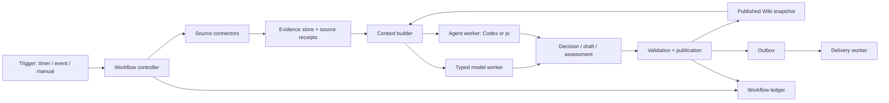

# LLM Wikiを通常ソフトウェア・モデル処理・Agent Harnessに分解する

状態: **検討用・未実装**。2026-09-27。
調査対象: ai-topics-agent `b87a0a2`、ai-topics-codex `3bf7d0d`、ai-topics `d1de5a96`。
実装・本番環境・認証・ジョブ設定は変更しない。

## 1. 設計判断

推奨は **通常ソフトウェアが業務状態を所有し、限定的なモデル処理と、探索的なAgent処理を呼び分ける構成**。
Hermesを別のフルスタックAgentに丸ごと置換するより、Wiki運用を中心に境界を引き直す。

「Harnessed Agentである必要のある箇所は薄いのでは」という仮説は、責務の広さについては妥当。
ただし、実行時間・コスト・品質への寄与まで小さいとはまだ言えない。
既存ページを読み、証拠を探し、矛盾を保存しながら複数ページを編集する統合作業にはAgentの価値が残る。
絶対にAgentでしか実装できない処理はほぼないが、固定workflowで同等品質を保つための実装負担と比較する必要がある。

本案の原則:

1. 起動・取得・状態遷移・検証・公開・配信・権限をモデルの判断に委ねない。
2. 入力と出力が固定できる意味処理はtypedなモデル呼び出しにする。
3. 次に調べる資料や編集方針を観測結果から決める処理にAgentを使う。
4. モジュール境界を先に作り、別サービスへの配備は必要になってから行う。
5. Codex版とpi版で共有するのは業務契約・成果物・評価であり、会話履歴やtool callの形式ではない。

現行[AGENTS.md](../AGENTS.md)はCodex専用・API fallbackなし・adapter registryなしを要求する。
本案の共通coreや別モデルworkerは**次期設計の変更候補**であり、現行契約を変更済みとは扱わない。
Codex workerはCodex専用のまま保ち、将来のpi workerを別の構成として用意する案である。

## 2. 現状の理解と根拠

| 対象 | 役割と評価 |
|---|---|
| ai-topics | raw、curated Wiki、SCHEMA、feed/hot-topics、既存Hermes運用資産。知識と証拠の正本 |
| ai-topics-agent | scheduler・state・delivery・collectorを独立させ、Hermes/pi/Codexをadapterで呼ぶ。Hermes内部importは排除済みだが`.hermes`パスと旧出力ABIを維持 |
| ai-topics-codex | Codex専用化、native sandbox、JSON handoff、runnerによる公開、versioned migration。安全境界は改善したが、業務処理全般を同一profileとrunnerに集めている |

両ドラフトは30ジョブ、有効27・停止3。Codex版の`no_agent:true`はsitemap-monitorとpipeline-watchdogの2件。
これは静的な設定件数であり、`wakeAgent:false`によるskipを含む実際の呼出回数ではない。

実装から確認した、設計を変える動機:

| 観測 | 根拠 | 設計上の意味 |
|---|---|---|
| blog-ingest、newsletter-ingest、dreaming-collect、tag-audit-weeklyのpromptはモデル不要と記載するが、manifestは`no_agent:false` | [jobs.json](../config/jobs.json)、[blog-ingest prompt](../assets/prompts/blog-ingest.md)、[runner](../src/ai_topics_codex/runner.py) | 宣言と実行が不一致。通常経路ではAgentを起動し得る。promptで実行modeを指定しない |
| triageはraw本文と既存Wikiを自分で読む | [blog-triage prompt](../assets/prompts/blog-triage.md)、[blog checkpoint](../assets/scripts/blog_checkpoint.py) | 現状のJSON出力だけを見て「一回の分類」とは扱えない。context作成を分離する必要 |
| newsletter候補のraw_pathはメールdigestを指す | [newsletter checkpoint](../assets/scripts/newsletter_checkpoint.py)、[メール処理](../assets/scripts/process_email.py) | pathの存在はリンク先記事の全文取得を意味しない。証拠の種類・取得品質が必要 |
| 設定・秘密値を含む環境をtrusted scriptに渡す | [Config.env](../src/ai_topics_codex/config.py) | モデルへの秘密値遮断とは別に、collectorごとの権限縮小が必要 |
| profile lockが取得・モデル実行・公開・配送まで覆う | [runner](../src/ai_topics_codex/runner.py)、[state](../src/ai_topics_codex/state.py) | 長い調査が収集や監視も待たせる。単にlockを外さず、先に共有書込を分離する |
| checkpoint/latestと最新成功runを使って段階を結ぶ | [runner](../src/ai_topics_codex/runner.py)、[triage checkpoint](../assets/scripts/blog_triage_checkpoint.py) | 単一profile直列運用には適合。複数batch/hostには固定batch参照が必要 |
| XのprocessedはAgentへ出力済みを意味する | [X bookmarks](../assets/scripts/fetch_x_bookmarks.py) | 取得済みとWiki反映済みを別状態にする。アーカイブからの再処理を維持 |
| 型、重複ID、参照path等の検証が既にある | [structured.py](../src/ai_topics_codex/structured.py) | 再利用できるcore。runnerの候補検査は`expected <= actual`なので未知IDも拒否する完全一致へ強化する候補 |
| 原文hash、hook、Git公開はrunnerが所有する | [publication.py](../src/ai_topics_codex/publication.py) | この境界は維持。モデルの成功と業務上の公開成功を区別する |
| モデル失敗時に途中の編集が残り得る | [architecture.md](architecture.md) | 隔離した候補workspaceと成果物提出に変えると再実行・比較が容易 |

ai-topicsのAGENTS/READMEには古い時刻やhook説明もあるため、現在のドラフト設定と実ファイルを優先した。
本調査は保存されたコードと設定の静的確認であり、稼働ホストの状態を確認したものではない。

## 3. 二分ではなく三種類の実行

| 種類 | 制御主体 | 例 | 出力 |
|---|---|---|---|
| D: 通常ソフトウェア | コードが手順・分岐・終了条件を決める | API取得、dedup、graph scan、schema検査、公開 | 型付きreceipt / artifact |
| M: 限定されたモデル処理 | コードが入力・rubric・呼出回数・経路を決める | 分類、claim判定、翻訳、固定資料からの要約 | Decision / Draft / Assessment |
| A: Harnessed Agent | モデルが結果を見て次の検索・読解・編集を選ぶ | gap調査、矛盾の調査、複数ページの再編・統合 | 証拠とChangeSet |

Dでもネットワーク応答は非決定的であり、Mも一回に限定する必要はない。
コードで固定したretrieve→classify→validateはMのworkflowで、モデルが探索手順を自律的に選ぶloopとは区別する。
JSONを返すAgentはAになり得るし、Markdownを生成するモデル呼出しはMになり得る。

また、**業務modeと実行backendは別軸**。現行のサブスクリプション条件を保つ最初の段階では、
M相当の仕事もCodex経由で実行してよい。それで純粋な推論APIになったわけではない。
入力固定・権限縮小・呼出予算を実装し、将来のtypedモデルへの交換点を作ることが先である。

## 4. 全30ジョブの再分類案

各行は将来の分解であり、現在の実行設定ではない。停止ジョブは停止を維持する。

| 現行job | 分解案 | Agentを残す条件 |
|---|---|---|
| blog-ingest | D: RSS取得・本文保存・receipt | 通常経路では不要 |
| newsletter-ingest | D: IMAP取得・メール保存・URL列挙 | 通常経路では不要 |
| dreaming-collect | D: 未統合rawのbatch作成 | 不要 |
| sitemap-monitor | D: 差分取得 | 不要 |
| pipeline-watchdog | D: 状態と遅延の監視 | 通知にも不要 |
| blog-triage | D: context作成 → M: 関連性・新規性・route判定 | 追加調査が必要な候補だけAへ |
| newsletter-triage | D: リンク先取得・context作成 → M | digestを全文と誤認しない。未取得は保留 |
| dreaming-group | D: 候補検索 → M: grouping・route判定 | 複雑な概念再編だけAへ |
| blog-wiki-ingest | D: context → MまたはA: 更新案 → D:検証・公開 | 複数ページの整合・反復調査。初期はA維持 |
| newsletter-wiki-ingest | 同上 | 同上 |
| dreaming-wiki-ingest | 同上 | 複数記事・概念の統合。初期はA維持 |
| x-bookmarks-ingest | D: 投稿/本文取得 → M: triage → A/M:統合 | 現job全体を単にno_agentにしてはいけない |
| x-accounts-scan | D: scan/取得 → M: triage → A/M:統合 | 同上。未取得のretryはconnector側で管理 |
| active-crawl | D: budget/候補作成 → A: gap調査・統合 | 主たるAgent用途 |
| trending-topics | D: signal集計 → M:順位付け → A:検証・統合 | 未知の一次資料の探索 |
| skeleton-enrich-daily | D: sparse page抽出 → A:調査・更新 | 証拠不足を探索で埋める |
| wiki-health-fix | D: scan/確定修復 → M:意味判定 → A:難しい修復 | scan・judge・repairを別段階へ |
| wiki-watchdog-fix | D:問題route → M/A:内容修復 | 運用障害は通常の運用系に戻す |
| wiki-graph-analysis | D:graph計算 → M:候補評価/報告 | 大規模な構造再編の提案だけA |
| tag-audit-weekly | D:taxonomy照合・承認済みalias正規化 | 曖昧なタグ統合のみM/A。未知タグを機械的に消さない |
| hierarchy-candidate-detection | D:候補計算 → M:scope比較 | 実際の移動・再構成は別のA作業 |
| jp-to-en-translation | D:AST/対象抽出 → M:本文翻訳 → D:構造照合 | 文脈が足りない場合だけA/保留 |
| weekly-ai-digest | D:週次変更と資料固定 → M:要約 | 新規調査を要件に加える場合だけA |
| ai-topics-slack-hot-posts | D:収集/dedup → M:要約/選別 → D:配送 | 通常経路では不要 |
| check-skill-inventory | D:manifest照合 → 任意M:説明 | 運用資産の修正は別の開発作業 |
| skill-drift-check | D:hash/diff検出 → 任意M:差分要約 | 同上 |
| llm-pricing-monitor | D:既知ページ取得 → M:単位込み抽出 → D:差分検査 | ページ構造・商品体系が変わった場合の調査 |
| wiki-health（停止） | D:scan + 任意M:判定 | 統合health pipelineへ整理。再有効化しない |
| wiki-health-plan（停止） | D:scan → M:優先順位 | 複雑な修復計画のみA。再有効化しない |
| raw-backlog-ingest（停止） | D:batch → M:triage → A/M:統合 | 手動batchとして上記部品を再利用 |

MはさらにDecision（閉じた回答集合）とGeneration（要約・翻訳・文章案）に分ける。
Jev型のclassifierだけでgroupの説明文、翻訳、Wiki本文まで代替できるとは考えない。

## 5. モジュールと所有する状態

| モジュール | 所有責務・状態 | 持たせないもの |
|---|---|---|
| Trigger | timer/eventからrun requestを投入 | 下流の成否判定、LLM prompt |
| Workflow controller | batch、stage、attempt、依存関係、予算、lease、retry | Agent内部の探索loop |
| Source connectors | 取得、pagination、source cursor、取得receipt、外部quota | curated Wikiの変更 |
| Evidence store | 不変の原文、URL/source ID/hash、取得状態・版 | provider session依存 |
| Context builder | snapshotに対する検索、候補page、抜粋、引用位置、coverage情報 | 隠れた探索・無制限の再取得 |
| Model worker | typed判定・限定生成、model/prompt/rubric版、usage | file編集、任意shell、公開、secret配布 |
| Agent worker | tools、context管理、探索・編集loop、cancel | 業務の成功台帳、通知・push、source cursor |
| Validator / Publisher | schema、リンク、raw照合、意味評価の集約、競合検出、公開receipt | Agentによる自己承認 |
| Delivery worker | outbox、送信先policy、試行とmessage ID | Wikiの再生成 |
| Credential / policy integration | identity、secret参照、scope、rotation/失効 | 本文promptへのcredential注入 |

初期の物理構成は「一つのcore package＋collector subprocess＋Codex subprocess＋配送処理」で十分。
JSON schema付きの関数/CLI境界を作り、ネットワークAPIやMCPは遠隔利用の必要が出た部分だけに足す。
各moduleをHTTP serviceにすると認証・deploy・障害復旧の運用が増え、今回の簡素化目的を損ない得る。

将来のrepository案は`wiki-core`、Codex composition、pi composition、contentの四つの所有単位。
最初から四つに分割せず、まずCodex版内でcoreへの依存方向を一方向にし、二つ目のworkerで抽出を検証する。
ai-topics-agent全体を共通coreにすると旧Hermes ABIも継承するため、実績あるロジックを選んで移す。

## 6. 相互運用の最小契約

すべてversion付き成果物とし、ローカル絶対pathをwire contractにしない。実行側がartifact IDをローカルpathに解決する。

| 契約 | 主な項目・検証 |
|---|---|
| BatchManifest | batch_id、source_item_id、raw_ref/hash、source_url、fetched_at、evidence_kind、fetch_status、config_version |
| ContextBundle | bundle_id/hash、batch_id、wiki_base_commit、対象pageとhash、証拠抜粋、retrieval版、truncation/coverage、policy版 |
| DecisionSet | batch/bundle参照、item_id、action、target_page_ids、reason code、evidence refs、abstain。要求IDと返却IDの完全一致 |
| Assessment | rule/rubric IDと版、claim/page参照、verdict、観測根拠、モデル固有scoreと校正情報 |
| AgentTask | task_id、bundle参照、base commit、許可capability、deadline、step/tool/token予算、出力契約 |
| ChangeSet | task/batch参照、base commit、変更pathとbefore hash、patch/new file、証拠ref、検証結果。管理領域・symlink・path逸脱拒否 |
| PublicationReceipt | operation_id、changeset hash、検証版、local commit、remote commit確認、公開状態 |

閉じたDecisionと自由文Draftは分ける。実行結果にも`completed`、`no_change`、`abstained`、`blocked`、`failed`を区別する。
通信timeout・schema不正を「関係ないのでskip」へ変換しない。`wakeAgent:false`だけで業務上の状態を表さない。
confidenceは全provider共通の確率と仮定しない。値がないbackendではnullとし、勝手な数値を補わない。

Evidenceではメールdigest、投稿本文、リンク先全文、要約、ログイン画面、部分取得を識別する。
newsletterのリンクを取得できなくてもメール自体を証拠にすることは可能だが、その範囲の主張に限定する。
Context builderの検索漏れは「Wikiに未掲載」の誤判定を生むため、候補検索のrecallも独立して評価する。

## 7. Wiki Healthを三段階にする

1. **構造検査（D）**: frontmatter、taxonomy、参照先、indexとの差、孤立度、日付、縮小率、raw hash。
   リンク先不存在はDで分かるが、正しい差し替え先や概念の同一性は分からない。
2. **意味検査（M）**: claimと引用箇所の支持関係、ページ間の重複候補、矛盾の未注記、scopeのずれ。
   判定に必要な資料を固定し、支持/非支持/不明を区別する。不明なら取得または人の確認へ戻す。
3. **修復（D/M/A）**: 一意に決まるindex修正はD、閉じた候補からの選択はM、調査を伴う再編はA。
   全てChangeSet経由で再検証し、judgeが合格と言っただけで公開しない。

Jevの公式APIはstateとtyped questionsを受け、Noul/Choice/Scoreの回答を返す。
その形は意味検査やroute判定の候補に合うが、Wiki全体の健全性を一回で判定する用途には広すぎる。
[TypeSafe公式API](https://docs.typesafe.ai/api)

OpenAIのStructured Outputsも出力構造を制約する選択肢だが、意味の正しさや証拠の十分さは別の検証になる。
[Structured Outputs](https://developers.openai.com/api/docs/guides/structured-outputs)

閾値は仮の0.9等で固定せず、Wikiの実例に人がラベルを付けて決める。
重要claimの誤受理、希少だが重要な記事の誤skip、過剰な重複統合を別々に計測する。
自己申告confidenceや同じモデルによる自己採点だけで採否を決めず、保留率と人の抜き取り監査も記録する。
全ページへの全件judgeは避け、変更page・変更claim・関連pageを中心にし、定期全体scanを併用する。

## 8. Scheduler、transaction、並列化

固定時刻の三段cronを、それぞれ同じbatchの成功で進むworkflowへ変更する。
時刻は収集の開始条件とし、triageや統合には新しいbatch IDを渡す。`latest.json`は閲覧用projectionに降格する。
通常timerを替えても、重複排除・catch-up・業務retryをtimerへ丸投げしない。

状態は少なくとも `collected → contextualized → decided → proposed → validated → committed → pushed`。
配送状態は独立させる。no_change、保留、failedはそれぞれ理由と次の操作を保存する。
stageの再実行キーはbatch ID・stage版・入力hashから作り、attemptと論理操作を分ける。
外部取得を再試行しても同一原文は重複登録しない。取得cursor更新は原文・receiptの永続化後に行う。
特にIMAPの移動/既読化は外部副作用なので、保存・checkpoint・メール移動間のcrashから照合できるreceiptが要る。

Agentは固定snapshotの隔離workspaceで作業し、変更案を提出する。
初期のraw正本は既存Git構成を維持し、collectorも追加候補をstagingしてpublisherへ渡す。
既存rawの上書きは拒否し、更新された外部記事は新しい証拠版として保存する。
indexの機械的登録・count・sortとlogの操作履歴はpublisherに寄せる。
indexの意味的な分類変更とSCHEMA/taxonomy変更は別の明示的提案にする。

公開だけを単一writerで直列化する。準備・判定・調査を並列化するのは、その分離後。
base commitが変わったら、関係するread set/page hashも確認し、変更が影響する場合は再context化・再生成する。
patchがテキスト上適用できることと意味がまだ正しいことは別である。
初期はstale baseを全件再検証する単純な方式でもよい。

Git pushとDB transactionはatomicではない。公開意図を先に台帳へ保存し、commitにoperation IDを記録する。
push応答喪失後はremote commitを照合し、同一ChangeSetを再生成・再commitしない。
公開確認後にoutboxをidempotentに作成し、crashで欠けたoutboxはreceiptから復元する。
配信先にidempotency機能がなければ重複通知の可能性は残る。exactly-onceは主張しない。

## 9. 認証・認可・Vault

中央管理するのは秘密値とポリシーであり、全workerへ全secretを配ることではない。

| identity | 付与する権限 |
|---|---|
| IMAP collector | 対象mailboxの必要操作、evidenceの追加 |
| X collector | 必要なX読取scope、evidenceの追加 |
| Model worker | 選択した推論backend、指定bundleの読取 |
| Agent worker | 指定資料と候補workspace、許可した検索・取得操作 |
| Publisher | 原文/変更案の検証、content Gitへの公開 |
| Delivery worker | 確定outbox、許可した宛先への送信 |
| Workflow controller | job状態、worker起動。全外部secretを直接扱う必要はない |

ローカル単一ホストではOS保護のsecret storageとjob別allowlistから始める。
遠隔workerや複数管理者が必要ならmanaged secret manager等へ実装を交換する。
secret参照、監査、rotation/失効、OAuth refreshの担当を契約にし、初期同意と再認証が必要な状態も表す。
認証情報の取得成功と「この変更を公開してよい」という業務認可は別のチェックである。

OpenAI Vaultsのhosted sandbox向けsecret注入は、その環境向けの仕組みであり、ローカルcollector一般への配布ではない。
従って共通coreの必須機能にせず、対応する配備のcredential integrationとして扱う。
[Vaults公式仕様](https://developers.openai.com/api/docs/guides/agents-api/tools/vaults)

## 10. Codex版とLocal LLM＋pi版の同型性

| 共通にするもの | 交換するもの |
|---|---|
| batch/evidence/context/decision/changeset/receipt | 推論provider、model、量子化・serving設定 |
| workflowとretry、公開・配送規約 | Codexまたはpiの起動・event・cancel処理 |
| semantic policy、rubric、acceptance corpus | native skill/toolへのbindingとprompt調整 |
| capability要件、権限試験、予算 | OS sandbox、filesystem/network isolationの実装 |
| 成果物と品質指標 | context容量、search backend、usageの観測方法 |

Model provider、Agent harness、Execution environment、Workflow runtimeを独立した選択軸として扱う。
Local LLMのclassifierはpiを経由せず呼んでよい。探索や編集にはpiのloopを使う。
同じMarkdown skillを読み込めるだけで同品質とは考えず、共通policyをbackend別promptにbindする。
履歴やthread IDはworker内部の復旧情報として保存しても、業務成果の唯一の正本にはしない。

必要capabilityはread/search/edit/structured-result/cancel等で宣言し、worker起動前に確認する。
未対応の検索やsandboxを黙って省略しない。既存pi adapterの通信実績と、同等の隔離があることは別に検証する。
token数はtokenizer間で単純比較せず、品質、処理時間、メモリ、運用工数、費用も比較する。
小さいcontextへの分割でcross-document関係を失う可能性も評価対象にする。

配備の発展形:

- 最初: 同一Linuxホスト、既存SQLite/local artifact、Codex worker、公開単一writer。
- 次: collectorを外部の定時実行環境へ。永続artifact転送とreceiptを加え、Wikiを共有mountしない。
- Local LLM版: 共通coreからGPUホスト上のtyped worker/pi workerへtaskを配送。
- 複数hostで実行をclaimする段階: durable queue、共有DB、lease/fencing、object storage等を選定。

ローカルSQLite＋flockをネットワーク越しに共有して分散制御の代用にしない。
collectorの実行時間、OAuth継続状態、CLI binary、GPU、ネットワーク条件により配備候補は異なる。
「serverlessへ全部移せる」ことを初期要件にはしない。

## 11. 既存OpenAIサービス検討との関係

[前の検討](openai-services-design-draft.md)は、責務をどのOpenAIサービスへ移管するかを中心にしていた。
本案は、その前に「どの責務がAgent実行を必要とするか」を決める。
SDK化は通信保守を減らし、hosted実行はホスト管理を移すが、不要なAgent呼出しや混在した業務境界は自動では消えない。

公式App Server資料も、深い製品統合と自動化job向けSDKを区別している。
SDK適合性の検証は有用だが、今回の境界整理と独立に進められる。
[Codex App Server](https://learn.chatgpt.com/docs/app-server)

現行サブスクリプション限定構成、APIを許容する構成、Local LLM構成を明示的なcompositionとして分ける。
Codex枠が尽きた際にJev/API/piへ自動fallbackする設計にはしない。
課金・品質・情報の送信先が変わる選択はdeployment policyで明示する。

## 12. 実装順序と学習のための検証

| 段階 | 作業 | 完了条件 |
|---|---|---|
| 0 | 現行baselineを凍結。no_agent/prompt不一致、処理件数、失敗分類を記録 | 有効27/停止3、入力・出力・権限の現状を説明できる |
| 1 | 明らかなDを取り出し、`mode: script / model / agent`等の正の宣言へ移行 | collector/reportでモデルを呼ばない、state/output/delivery互換。X統合等を落とさない |
| 2 | blog一本でBatchManifestとContextBundle、DecisionSetを導入 | 同じbatchを再生できる、未知/欠落IDを拒否、原文品質を識別 |
| 3 | healthをD/M/Aへ分け、judgeをshadow実行 | judgeで自動修復せず、人ラベルとの誤受理/誤skip/保留率を測定 |
| 4 | 隔離workspace、ChangeSet、公開receiptを導入 | 途中失敗で正本を汚さない、競合・push応答喪失から復旧できる |
| 5 | pi/Local LLMを別compositionとして追加 | 共通契約と隔離試験を通り、同一入力で品質差を測れる |
| 6 | 必要なmoduleだけ別hostへ移す | crash、重複、再接続、credential失効、復元の試験を通す |

case studyの比較は、固定batchと固定Wiki snapshotに対して行う。
まず同じCodex backendで入力固定の効果を測り、次にモデルを替える。
model・harness・retrieval・promptを一度に替えると、改善/悪化の理由が分からなくなる。

測定対象:

- D: 原文保存の欠落/重複、cursorの整合、再試行で外部副作用を増やさないか。
- M: rare topicを含む関連性recall、route精度、claimの誤受理、保留率、検索recall。
- A: 出典付きで正しい更新、重複page率、矛盾保存、既存情報の退行、人の修正時間。
- システム: 公開までの遅延、Agentへの昇格率、モデル呼出数、実測usage、運用工数、障害回復時間。

少量の人手ラベル付きcorpusでrubricを校正し、別のholdoutで比較する。
「JSON成功率が高い」「Agent呼出しが減った」だけを成功基準にしない。
難しい例をAgentへ昇格した結果の総品質・総費用まで評価する。

優先すべき次の一歩は **blog pipelineをD→M→A→Dに切り分ける一本の縦断試作**。
収集のモデル不要化、contextの固定、統合Agentの維持、検証公開の明示化を同時に観察できる。
新しい汎用Agent frameworkや多数のmicroserviceを先に作るより、境界の妥当性を小さく検証できる。

未確定事項は、Mへ移せる統合作業の範囲、実データでのjudge精度、サブスクリプション外APIの許容、
Local LLMの品質/ハードウェア条件、別hostへ移す運用上の必要性。
いずれも本書で採用済み・検証済みとは扱わない。
