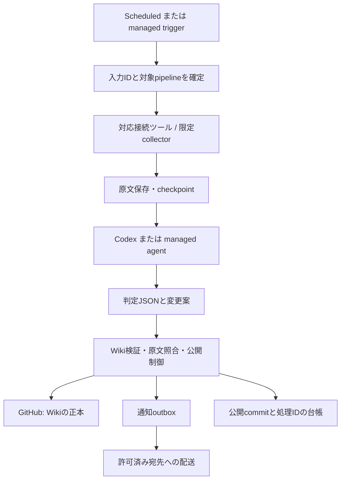

# OpenAIサービスを使った周辺基盤の簡素化 — 設計ドラフト

状態: **提案・未実装**。調査日: 2026-09-27。対象実装: `9fa4987`。

本書は、現在のCodexネイティブ版について、SDKやサービスに任せられる責務を再評価する。
実行コード・依存パッケージ・認証・定期実行・ホスト設定は変更しない。既存Lucy/Nanaを維持する。
API利用を検討する案は、現在の[開発契約](../AGENTS.md)の変更候補であり、既に採用された方針ではない。

## 1. 推奨する方向

簡素化できる余地は大きい。ただし「サブスクリプションでモデルを実行すること」と
「実行環境・認証・定期実行をOpenAIに預けること」は別の選択になる。

1. **現在の前提を維持するなら、公式Python Codex SDKへの置換を最初に検証する。**
   独自JSON-RPC通信を減らし、Wiki固有の処理だけを残す。ヘッドレスホストでの定時起動までSDKに移せるわけではない。
2. **常駐ホストと自作スケジューラの撤去を優先するなら、ChatGPTのクラウド定期実行と接続ツールを評価する。**
   ローカルフォルダ中心からGitHubと公開範囲を制限したWiki操作ツール中心に変える必要がある。
   対象アカウントでの利用可否・書き込み権限・使用枠を確認するまで本命に固定しない。
3. **API課金を許容するなら、Agents API + OpenAI-hosted sandbox + Vaultsが基盤削減の有力案。**
   Responses APIやAgents SDKだけへの全面移植より、実行環境まで管理サービスに任せやすい。
   起動トリガー、Wikiの公開制御、取得元固有の処理は別途必要になる。

今回は1を第一候補、2を条件付き候補、3を課金条件変更時の候補とする。
SDKの採用だけを「周辺基盤の完全なサービス化」とは評価しない。

## 2. 現在の責務と置換可能性

実装・設定を読み取った結果。現在の構成は[architecture.md](architecture.md)も参照。

| 責務 | 現在 | サービス等への移管候補 | 残る責務・注意点 |
|---|---|---|---|
| Codex通信 | [`codex.py`](../src/ai_topics_codex/codex.py)のJSONL/RPC、イベント対応、終了処理 | Python Codex SDK | 認証方式・使用枠・権限の検査はアプリの方針として残す |
| 定時起動 | [`schedule.py`](../src/ai_topics_codex/schedule.py)、`runner.tick`、`serve`の常駐ループ | Scheduled tasks、適格なWorkspace Agentのトリガー、外部マネージドスケジューラ | 依存段階の成功・鮮度・重複実行・取りこぼし対策 |
| ホスト運用 | systemd用unit生成、Python/CLI、bubblewrap/AppArmor | クラウド側の実行環境 | ローカルCodex SDKを選ぶ限りホスト運用は残る |
| 外部クレデンシャル | [`config.py`](../src/ai_topics_codex/config.py)の平文`secrets.json`、xurlの`.xurl` | 接続済みApps/Plugins、Agents API Vaults | 対応サービス・認証方式ごとの適合、初回同意、権限・失効管理 |
| 収集 | RSS/IMAP/X/Slack/sitemapのスクリプトとCLI | 対応する接続ツール、イベントトリガー、MCP | 原文全文・取得ID・既読位置・重複防止の同等性 |
| 通知 | [`delivery.py`](../src/ai_topics_codex/delivery.py)、[`notify.py`](../src/ai_topics_codex/notify.py) | ChatGPTの実行結果画面、接続先の送信ツール、配送サービス | Discord/Telegramを維持するなら送信処理と再送状態 |
| 実行履歴 | SQLite ledger、イベントログ | SDKイベント、Agents API session/trace、Scheduledの実行一覧 | 何を取得・検証・公開したかを表す業務台帳 |
| 構造化handoff | [`structured.py`](../src/ai_topics_codex/structured.py) | SDK/APIの構造化出力 | candidate全件の判定、参照ID・原文パスの整合性検査 |
| Git公開と原文保護 | [`publication.py`](../src/ai_topics_codex/publication.py)、writer lock | 制約付きWikiツール、GitHub上の公開処理 | 同時更新制御、rawハッシュ、許可パス、hooks、競合処理 |
| スキル配布 | [`profile.py`](../src/ai_topics_codex/profile.py)、assets同期 | スキル/Pluginパッケージ、環境テンプレート | バージョン固定、feed定義との対応、入力と原文のバックアップ |

30ジョブのうち27が有効、3が停止中。現在はOSのcronでもCodexのScheduled tasksでもなく、
**Python製のスケジューラをsystemdで常駐させる設計**である。unit生成とサービス有効化は別であり、
この調査で新サービスを起動していない。

## 3. 公式機能の確認結果

### 3.1 Codex SDK: 既存構成に最も導入しやすい

Pythonの`openai-codex`はstableとして公開され、ローカルApp ServerをJSON-RPCで操作する。
公開SDKには固定されたCLIランタイム依存があり、既存CLIを使う指定もある。
TypeScript版も存在するが、本プロジェクトをそのために別言語へ移す必要はない。
[`sandbox=`を省略するとApp Serverの既定設定を継承する](https://learn.chatgpt.com/docs/codex-sdk)。

本件では、`Codex`/`AsyncCodex`のライフサイクルとイベント処理へ寄せ、既存の`JsonLines`を縮小する。
一方、次を確認するまでは「全面置換できる」と確定しない。

- `account/read`と使用枠確認、構造化出力、turnの識別、interrupt、承認要求拒否を扱えるか。
- 子プロセス環境のallowlistと専用認証ディレクトリを維持できるか。
- `wiki-native`の場所別permission設定を継承し、既存の11項目のsandbox検査が通るか。
- SDK同梱CLIと現在の検証版`0.157.1`の差を確認し、SDKとランタイムを固定できるか。

足りない操作だけ薄いApp Server呼出しとして残すことは許容する。
サンプルの`Sandbox.workspace_write`をそのまま指定すると現在の細かな権限を上書きし得るため、
SDK導入と権限緩和を一緒にしない。SDKへの変更は、スケジューラ、Vault、Discord gatewayの提供を意味しない。

### 3.2 Scheduled tasks: 起動管理は任せられるが、実行場所が変わる

公式資料で確認できた境界は次のとおり。

| 実行面 | ファイルへのアクセス | 本件との適合 |
|---|---|---|
| デスクトップ | ローカルproject/worktree。端末とアプリの稼働が必要 | GUI常駐を受け入れる場合の候補。現在のヘッドレス運用の直接代替とは扱わない |
| Web/mobile | 接続ツールやアップロード資料。ローカルフォルダは直接扱えない | GitHub/ツール中心への再設計が必要 |
| CLI/IDE | Scheduledの管理UIなし | 公開資料からヘッドレス用の同等なスケジューラ管理APIは確認できなかった |

適格なプランではGmail・Slack・GitHubの特定イベントもトリガーにできる。
ただしSlackのリアクション等は対象外なので、現在のhot-posts収集をそのまま代替できるとは限らない。
利用可否はプランと管理者設定に依存する。[Scheduled tasks](https://learn.chatgpt.com/docs/automations)

**設計判断:** 30個のcronを30個の自然言語タスクに写す案は採らない。
まずblog/newsletter/dreamingの3段階処理をそれぞれ1つの業務パイプラインとして扱い、
起動後は成功した段階から次へ進む。現在の10:00→10:20→10:40のような固定間隔を、
「収集成功→判定成功→公開」に置き換える案である。収集の時刻・頻度を変えるかは別に決める。

Scheduledの履歴を永続ledgerの代わりに使える保証、停止期間のcatch-up、全ジョブ間の排他、
外部副作用の一度だけの実行は確認できていない。これらは下記Wiki操作側で処理する。
cronからRRULE等へ変換する場合も、月跨ぎ・曜日と日付の条件を検証する。
特に`*/2`の日付指定を「前回実行から48時間」と読み替えない。

### 3.3 Workspace Agents: クラウド運用の候補だが、APIの戻り値に制約

公開済みWorkspace AgentはAPIから起動できる。トリガーには永続キューと`Idempotency-Key`があり、
同じイベントの再投入を抑止できる。実行状態の取得はbetaだが、**エージェントの回答本文はAPIから取得できない**。
したがって、既存の「最終JSONを受け取って次段へ渡す」処理の差し替えには使えない。
結果は検証付きWikiツールへ保存させる必要がある。
[起動と状態取得](https://developers.openai.com/workspace-agents/trigger-runs)

認証はChatGPT側で管理するWorkspace Agent用access tokenで、管理者の許可と専用scopeが必要。
CodexログインやPlatform APIキーと同一ではない。
[認証仕様](https://developers.openai.com/workspace-agents/authentication)

契約・使用枠も別途確認する。Workspace Agentの利用を現在の個人サブスクリプションで
追加費用なく実行できるとは仮定しない。ChatGPT Work、Workspace Agent、ローカルCodexの
権限設定は同じ管理面ではない。
[管理と使用枠の説明](https://learn.chatgpt.com/docs/enterprise/work-admin-faq)

### 3.4 Agents API: ハーネスと実行環境の管理を減らせる

Agents APIはOpenAI側でCodexハーネスとsessionを管理する。自前のApp Server起動・再接続・
会話状態管理の一部を移管できる。**モデル利用はAPI課金**で、ChatGPTログインの使用枠を使う方式ではない。
現在の資料では米国以外のdata residencyとZDRに制約がある。
[概要](https://developers.openai.com/api/docs/guides/agents-api/overview)

`openai_hosted`を選ぶとLinux実行環境の準備も任せられる。
ただし環境テンプレートは設定の再利用であり、永続Wikiディスクではない。
workspaceはsandboxの存続中に保持され、出力artifactの公開機能がある。
ホスト環境の料金はモデル料金とは別である。
[Hosted sandbox](https://developers.openai.com/api/docs/guides/agents-api/environments/openai-hosted)

**設計判断:** sessionをWikiの正本にしない。Gitのbase commitと原文IDを入力にし、
結果を検証・公開してから成功とする。次のsessionでは公開済み状態から再構築する。
OpenAI側の隔離環境に移す場合、利用者側での実行環境管理は不要になる。
本件でself-hosted sandboxを選ぶとホスト管理が残り、今回の目的への効果は小さい。

Webhookはsessionの状態変化を知らせるもので、定期起動の代わりではない。
また`idle`だけではturn成功を判定できない。受信側は現在の状態と成果物を確認する。
[Session webhooks](https://developers.openai.com/api/docs/guides/agents-api/sessions/webhooks)

確認した公開資料から、Agents API自身にこの30ジョブを登録できるcronサービスは確認できなかった。
外部のマネージドトリガー、または対応するChatGPT側トリガーと認証付き接続ツールが別に必要である。
後者を使う場合も、ChatGPTから任意のAPIが自動的に呼べるとは仮定しない。

### 3.5 Responses API / Agents SDKを主軸にする案

Responses APIのbackground modeは長い応答を非同期に実行する機能で、将来時刻の繰り返し起動ではない。
これだけで常駐処理・外部認証・Git公開制御はなくならない。
[Background mode](https://developers.openai.com/api/docs/guides/background)

Agents SDKはagent loop、tools、handoffなどを共通化できるが、デプロイ、ツール実装、永続化はアプリ側が持つ。
現在すでにCodexがagent loopを担当しているので、その外側へ別のloopを足すだけでは単純化しない。
新たに細かいモデル選択やAPI中心の独自フローが必要になった場合に再評価する。
[Agents SDK](https://developers.openai.com/api/docs/guides/agents/sdk)・[ランタイム比較](https://developers.openai.com/api/docs/guides/agents)

## 4. 外部認証とメッセージ通信の設計

### 現状の改善点

モデルprocessには秘密値を渡さず、sandboxでも認証領域を拒否している。一方、
trusted runner側は取得・配送用secretをまとめて環境に読み込むため、collector単位の最小権限ではない。
ファイルのアクセス制御はあるが、`secrets.json`は暗号化Vaultではない。xurlのOAuth情報は別の`.xurl`にある。

Codex SDKへの置換だけでは、この点は改善しない。Apps/Pluginsが対象操作を提供するなら接続管理を任せ、
対象外の認証だけを限定した取得・配送処理に残す方針が必要になる。

### Vaultsでできることと、できないこと

Agents API Vaultsは、OpenAIからremote MCPへの認証と、hosted sandboxからのAPIアクセスに使える。
後者ではsandbox内の値をplaceholderにし、許可先HTTPSヘッダーでproxyが秘密値を差し込む。
自前ホストやアプリ側function toolへのsecret配布機能ではない。
MCP OAuthのrefreshには対応するが、初回の同意取得は利用側の責務となる。
[Vaultsの仕様](https://developers.openai.com/api/docs/guides/agents-api/tools/vaults)

以下はその仕様と現在のコードからの**適合性の推論**であり、接続試験済みではない。

| 対象 | 置換案 | 判断 |
|---|---|---|
| Discord Bot送信 | 許可hostへのAuthorizationヘッダー注入、または制約付き配送MCP | 技術的候補。ただしWiki生成sessionに送信権限を持たせず、検証済みoutboxだけを送る |
| Telegram送信 | 配送サービス/MCP側でtokenを所有 | 現コードはURLにtokenを含む。確認済みのヘッダー注入仕様では直接代替しない |
| xurl | X用接続ツール/MCP、または独立した取得処理 | `.xurl`をVaultへ移せば動くとは扱わない。OAuth更新・権限・bookmarks等の操作を確認 |
| IMAP | 対応メール接続への移行、または限定したIMAP collector | IMAP認証はHTTPSヘッダー注入の対象外。Gmailトリガーも任意のIMAPの代わりにはならない |
| Slack収集 | 接続済みSlackツールと対応イベント | 取得範囲、リアクション、スレッド、既読位置、原文保存を現行と比較 |
| GitHub | 読み取り接続＋検証付きpublisher | モデルへの汎用push権限の付与でpublisherを代替しない |

ChatGPTの接続認証がローカルCodexやAgents APIへ自動継承されるとは仮定しない。
「OpenAIへの認証」「接続先への認証」「送信や公開を許す業務権限」を別々に設計する。
SDK/APIを変えてもX等のサービス側の費用やアクセス条件は残る。

### Discord等のチャネル

現状はDiscord/Telegramへの送信のみで、受信gateway、slash command、チャネルと会話の対応付けはない。
ChatGPTの実行一覧を通知先にすれば、通知処理を減らせるが、既存チャネルで受け取るという要件が変わる。

Discordを維持する案では、送信は検証済みoutboxを扱う小さな配送機能に限定する。
双方向化を求める場合だけ、公式/既存のチャネル用ライブラリやサービスを使った受信処理を追加する。
受信イベントIDの重複排除とチャネル権限を持たせ、会話sessionとバッチの公開権限は分ける。
OpenAIがDiscord gatewayまで管理する公式の対応機能は今回確認できなかった。

公式Agents APIのSlack bot例でも、Slack受信、token、会話対応付けはアプリが担当する。
この例は追加の実行基盤を必要とするため、参考にする範囲を責務分担に限定する。
[公式Slack bot例](https://developers.openai.com/cookbook/examples/agents_api/apps/slack_bot/readme)

## 5. 構成案の比較

| 案 | 課金・利用条件 | 削減できるもの | 残るもの | 評価 |
|---|---|---|---|---|
| A: Python Codex SDK + 現行runner | ChatGPT認証を維持する設計。SDKでの確認が必要 | 自前RPC、ランタイム配布の一部 | ホスト、起動、収集、secret、配送、業務状態 | 最初の検証候補。変更範囲が小さい |
| B: デスクトップScheduled + スキル | 対応プラン・常時稼働端末 | 自作の時刻判定・常駐ループ | GUI稼働、限定ツール、業務状態 | ヘッドレス運用の代替としては優先しない |
| C: ChatGPTクラウドScheduled / Workspace Agent + Wikiツール | 対象機能・接続・権限・workspace使用枠の確認が必要 | 常駐ホストのモデル実行、起動管理、対応するOAuth/チャネル処理 | GitHub正本、非対応collector、制約付き公開・配送、ツールのhosting | サブスクリプション側で基盤を減らす条件付き候補 |
| D: Agents API hosted + Vaults + 外部マネージド起動 | APIモデル・環境・関連サービス課金 | ローカルCodex、sandboxのホスト管理、会話状態管理、対応secret管理 | トリガー、業務状態、publisher、非対応認証・配送 | API課金を認める場合の候補 |
| E: Responses API / Agents SDK中心 | 通常のAPI構成ではAPI課金 | モデル呼出しやloopの部品 | 本件の運用責務の多く | 基盤簡素化だけを目的とした全面移植には採らない |

料金は現行サブスクリプション額との単純比較では決めない。
A/Cは共有使用枠と停止時の運用、Dはモデルtoken・sandbox・保存・ツール・外部起動/配送費を見積もる。
現在の合成テストのtoken数だけで実データ運用の月額を推定しない。

## 6. クラウド案で残す小さなWiki操作層

以下はC/Dに共通する提案。APIやMCP化それ自体を目的にせず、既存の検証処理を再利用する。
Aを選ぶなら、同じ境界をPython内の関数として保ち、remoteサーバーを増やさない。

| 操作例（概念上の名前） | 入出力・守る条件 |
|---|---|
| `prepare_batch(source, cursor)` | source側IDと原文ハッシュを固定したbatchを返す。再試行では同じbatchを再利用 |
| `submit_decisions(batch_id, decisions)` | strictな型に加えて候補全件・参照IDを検証。成功時だけ次段を解放 |
| `submit_changes(batch_id, base_commit, patch)` | Wikiの許可パスのみ。raw、管理コード、Git metadataの変更は拒否 |
| `publish(validated_change_id, operation_id)` | 同時更新を検出し、検証済み変更のみcommit/push。モデルが任意引数でGitを実行しない |
| `deliver(outbox_id)` | 宛先・内容は確定済み台帳から取得。モデルに任意宛先やtokenを渡さない |

これは汎用のagent frameworkを再実装する提案ではない。次の業務上の保証は、
session永続化・structured output・sandboxだけでは提供されないため残す。

- 原文の不変性と出典追跡。agentが変更できない正本側のハッシュと照合する。
- 取得済み・判定済み・公開済みの区別。conversation履歴を処理済み台帳にしない。
- 更新競合の検出。ローカル`flock`を別ホストに持ち出しても分散排他にはならない。
- 入力と出力の対応付け。モデルが「成功」と述べても公開完了にはしない。
- 通知の再送。公開成功後の配送失敗でWiki処理をやり直さない。

クラウド案では、公開を直列化するmanaged queue/workerと永続台帳、または同等の仕組みを選ぶ。
Gitのbase commit比較と通常のpush競合も使い、force pushは行わない。
queueの重複排除と外部送信の副作用は別問題である。Discord等で受理直後に応答を失った場合は
完全な一度だけの送信を保証できないので、配送状態とprovider message IDの照合を設計する。

rawの保存先は現在のcontent repositoryとの整合を保つ。大きな原文を別storageに移す判断は別途行い、
APIのartifactや一時workspaceだけを唯一の保存先にしない。GitHubと台帳の両方を含む復元手順が必要になる。

## 7. 検証順序と採用条件

**この節は今後の検証計画であり、実行済みの記録ではない。**

1. **SDK差し替えの小規模検証。** 隔離した合成Wikiで、認証・使用枠・構造化handoff・interrupt・
   sandboxの境界・raw不変性を現行版と比較する。採用条件はAPI課金へのfallbackなしで同等動作すること。
2. **対象アカウントの機能確認。** クラウドScheduled、Workspace Agent、使用枠、GitHubの読み書き、
   必要な接続先操作を確認する。Workspace Agentを使うならAPI回答取得の制約を含めて成果物保存を実証する。
3. **一つのpipelineだけをクラウド試験。** 公開/合成RSSからraw→判定→Wiki変更案まで。
   不達・重複イベント、前段失敗、起動重複、環境失効後の復元を試し、成功率と運用負担を比較する。
4. **取得・認証の同等性試験。** raw全文、ページング、既読位置、OAuth更新、失効、
   Slackのリアクション等を確認する。Vault案は認証方式が合う接続先ごとに試す。
5. **公開・配送の障害試験。** 並行更新、push後の応答喪失、配送途中の失敗、429/再送を検証する。
   自動再実行が入力の二重取得や二重公開を引き起こさないことを採用条件にする。

最初のモデル試験には合成/公開データを使う。実データ・外部接続を用いた移行検証の範囲は、
その時点で決める。本書を根拠にクレデンシャル登録、実メールのアップロード、外部通知を実施しない。

## 8. この調査の結論と未確定事項

今の実装には、公式SDKで減らせる通信処理と、サービスの選択で減らせる実行インフラがある。
特に「自前RPC」「自前の定時起動」「対応済みサービスのOAuth管理」を別々に判断すると、
大規模な再移植をせずに削減できる部分が明確になる。

一方、**サブスクリプション・ヘッドレス常時運用・現在の取得元/チャネル・厳密なWiki更新をすべて維持しながら、
独自処理とOS依存を完全になくせる公式機能の組合せは確認できなかった。**
SDK移行だけで満足せず、クラウド実行へ移す価値と、新しく必要になるツール運用を比較するべきである。

未確定なのは、対象アカウントでの各機能の利用資格、SDKの詳細操作互換性、
接続ツールによる現行データ取得の同等性、無人書き込み権限、実運用コストである。
これらを確認後、Aを継続するかC/Dへ移すかを一つに決める。複数ハーネスの恒久的な切替基盤は作らない。
